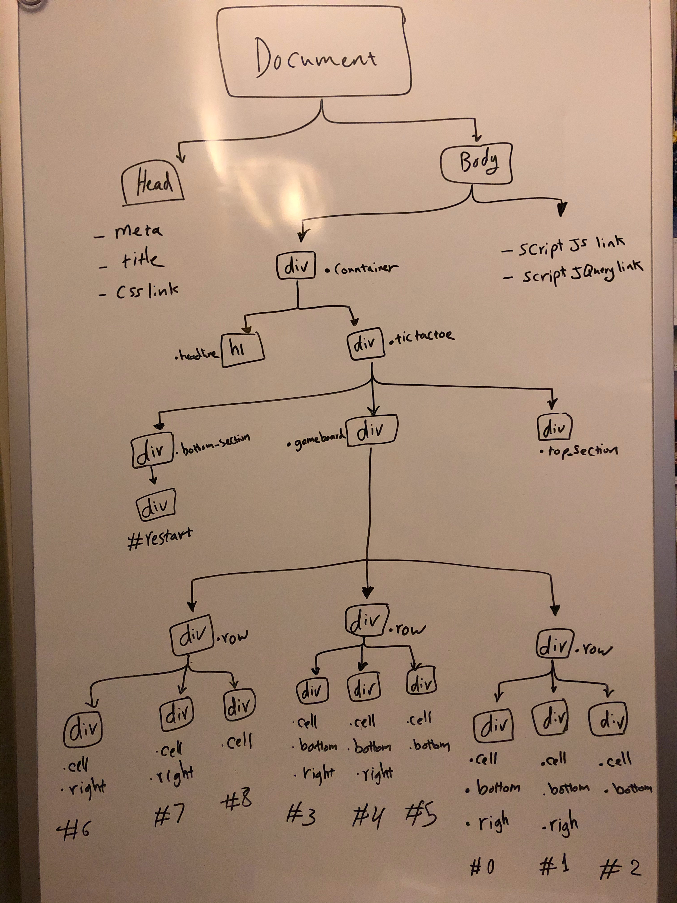
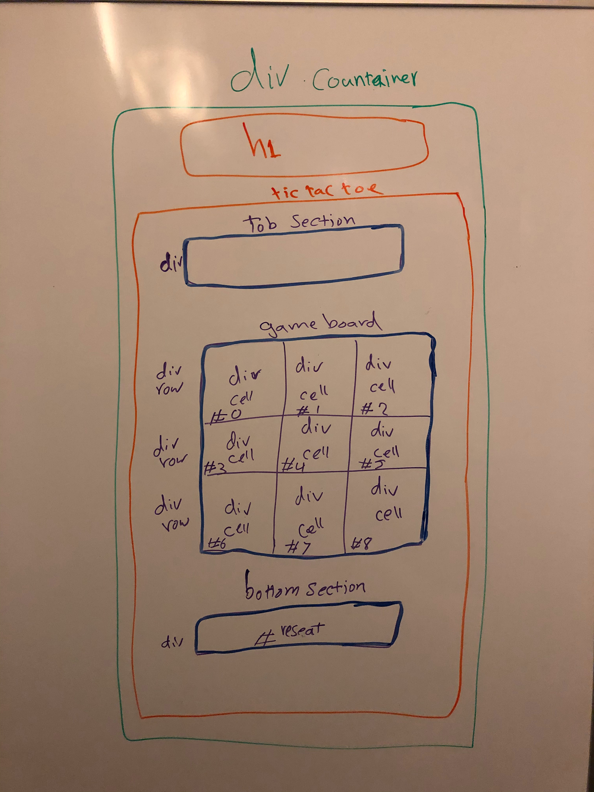

# Tic Tac Toe

## Overview

The first project at General Assembly Software Engineering Bootcamp is to build a game so I decided to create a player vs. player Tic Tac Toe game. 

When players visit the site, the game will start and the players can click on the "About The Game" button to activate an alert with information about the game. 

The information consist of directions on how to play the game. Those directions are to let them know that "X" always plays first then "O" plays second so all they need is to decide who plays when and click "ok" to get started.

Now that the players ready to play, they can click on the empty cells of the game board and alternate. If the players click on a used cell, they will get an alert to let them know they can't select it. Otherwise, they can keep playing until one of them wins or no one wins so it's a tie. Then, they get an alert to let them know they can restart to play another round.

## Game Live Site
https://tic-tac-toe-git-master.mahamahmood.vercel.app/

## Technologies Used

- HTML5, CSS, Javascript, JQuery
- Visual Studio Code

## Approach Taken
The approach I took is that I gave all cells of the game board a class of "cells" and created an event listener to listen to any click with the class of "cells". Once a click occurs, the event handler will check a few if statements. If the conditions are met in the if statements, the current target will get a class and text of "x" for the first click and a class and text of "o" for the second click.

For the win logic, I gave all cells a unique id of numbers from 0-8 (hard coded in HTML). Then, created a win function that checks for all of the 8 possible ways to win the game. For example, if the cells with the ids of #0, #1, #2 has the same class of either "o" or "x", then that's a win and so on.

The tie logic on the other hand has "46,080" ways to actually happen! Thus, my code wouldn't be DRY if I checked for all the tie options so I decided to create a very simple function that checks if the winning status is false and the click counter is equal to 9. The click counter is a variable that increments after each click on the cells.

## Features

- About The Game Button
- Restart Button
- Alerts

## Wireframes 

## Future Development

- Score Board
- Players Names' Input
- Responsive Desgin
- For product usability purposes, stop the alert of "Click Restart" after the players play for 2 or 3 rounds.